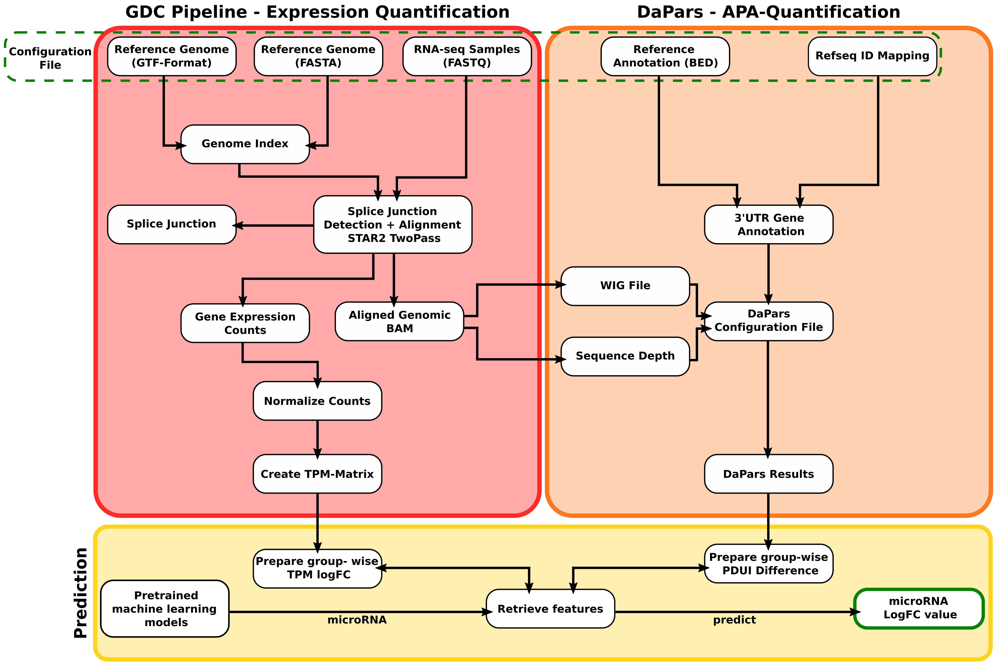

# MIRNAPEX (MicroRNA logFC from Alternative Polyadenylation and Expression)

MIRNAPEX is a computational pipeline that predicts differential expression values (logFC) of microRNAs directly from raw RNA sequencing data.



It uses pretrained machine learning models to compute microRNA logFCs from transcriptomic features—specifically, alternative polyadenylation (APA) changes and gene expression differences between two groups of samples. These groups can:

- Contain any number of samples
- Include a mix of **single-end** and **paired-end** RNA-seq FASTQ files

MIRNAPEX processes the data from alignment and quantification to feature extraction and final microRNA prediction in a fully automated Snakemake pipeline.

---

The pipeline operates in three main stages:

1. **RNA Expression Quantification**  
   Processes raw single-end or paired-end FASTQ files and quantifies gene expression using the STAR-based [GDC mRNA quantification pipeline](https://docs.gdc.cancer.gov/Data/Bioinformatics_Pipelines/Expression_mRNA_Pipeline/).

2. **Alternative Polyadenylation (APA) Analysis**  
   Identifies APA events using [DaPars2](https://github.com/3UTR/DaPars2) to compute PDUI (Percentage of Distal polyA site Usage Index) values.
 
3. **microRNA Prediction via Machine Learning**  
   Computes the mean log fold change (logFC) in gene expression and the mean difference in PDUI (Percentage of Distal polyA site Usage Index) between sample groups.  
   For each microRNA, MIRNAPEX uses a predefined set of target genes, and extracts relevant features (logFC and PDUI differences) specific to those targets.  
   These features are then fed into microRNA-specific pretrained machine learning models, resulting in individual logFC predictions for 1165 microRNAs, along with an associated prediction confidence label (e.g., *High*, *Moderate*).


---


## Installation

MIRNAPEX depends on the following software tools:

- Snakemake 
- STAR
- BEDTools
- SAMtools
- Python
- SciPy-bundle
- pandas, numpy, scikit-learn

You can install them using `conda`:

```bash
conda create -n MIRNAPEX_env python=3.8
conda create -p MIRNAPEX_env -c conda-forge -c bioconda python=3.8 snakemake star bedtools samtools=1.16.1
conda activate MIRNAPEX_env
```
Install python dependencies:
```bash
pip install pandas numpy scikit-learn
```
### Install DaPars2

Clone the DaPars2 repository into the `tools/` directory:

```bash
git clone https://github.com/3UTR/DaPars2.git tools/DaPars2
```

---

## Reference Files

Download the required genome and annotation files into `data/reference/`:

```bash
cd data/reference

wget -O data/reference/gencode.v44.annotation.gtf.gz \
  https://ftp.ebi.ac.uk/pub/databases/gencode/Gencode_human/release_44/gencode.v44.annotation.gtf.gz
gunzip data/reference/gencode.v44.annotation.gtf.gz

wget -O data/reference/GRCh38.primary_assembly.genome.fa.gz \
  https://ftp.ebi.ac.uk/pub/databases/gencode/Gencode_human/release_44/GRCh38.primary_assembly.genome.fa.gz
gunzip data/reference/GRCh38.primary_assembly.genome.fa.gz
```

The following files are already provided and used for DaPars2 annotation:

- `data/reference/hg38_refseq_IDmapping.txt`
- `data/reference/hg38_wholeGene_annotation.bed`

---
## Model Files

MIRNAPEX uses pretrained microRNA-specific regression models to perform logFC predictions. These models are included in the `data/model/` folder:

- `combined_models.pkl`:  
  A pickle file containing 1165 individual microRNA-specific regression models. Each model is trained on PDUI and logFC features of predefined target genes.

- `microRNA_model_r2_scores.csv`:  
  A CSV file containing the cross-validated R² scores for each microRNA model, indicating its prediction reliability. The confidence level (*High*, *Moderate*) in the final output is derived from this score.

Before running the pipeline, extract the model files by running:
```bash
unzip data/model/combined_models.zip -d data/model/
```

## Input Data

Place your raw FASTQ files in the `data/raw/` directory.

Supported formats:
- Single-end: `SRRXXXXXXX_1.fastq`
- Paired-end: `SRRXXXXXXX_R1.fastq` and `SRRXXXXXXX_R2.fastq`

MIRNAPEX supports a mixture of single-end and paired-end data across samples.

---

## Configuration

Edit the `config/config.yaml` file to define your project and sample metadata.

### Example 1: Single-End Samples

```yaml
reference:
  genome: data/reference/GRCh38.primary_assembly.genome.fa
  gtf: data/reference/gencode.v44.annotation.gtf

project_name: your_project_name

samples:
  SRR0000001: [data/raw/SRR0000001_1.fastq]
  SRR0000002: [data/raw/SRR0000002_1.fastq]
  SRR0000003: [data/raw/SRR0000003_1.fastq]
  SRR0000004: [data/raw/SRR0000004_1.fastq]

groups:
  group1: ["SRR0000001", "SRR0000002"]
  group2: ["SRR0000003", "SRR0000004"]
```

### Example 2: Mixed Paired-End and Single-End Samples

```yaml
reference:
  genome: data/reference/GRCh38.primary_assembly.genome.fa
  gtf: data/reference/gencode.v44.annotation.gtf

project_name: your_project_name

samples:
  SRR0000101: [data/raw/SRR0000101_R1.fastq, data/raw/SRR0000101_R2.fastq]
  SRR0000102: [data/raw/SRR0000102_R1.fastq, data/raw/SRR0000102_R2.fastq]
  SRR0000103: [data/raw/SRR0000103_1.fastq]
  SRR0000104: [data/raw/SRR0000104_1.fastq]

groups:
  group1: ["SRR0000101", "SRR0000103"]
  group2: ["SRR0000102", "SRR0000104"]
```

### What Are Groups?

Groups define sets of samples to be compared. MIRNAPEX calculates:

- The **mean gene log fold change (logFC)** between the two groups.
- The **mean PDUI difference** (shortening/lengthening) across groups.
- These values are used as features for the **pretrained machine learning models** to predict microRNA logFCs.

---

## Running the Pipeline
Activate the environemnt (if installed with conda):
```bash
conda activate MIRNAPEX_env
```

After setup, run the pipeline from `MIRNAPEX/` directory:

```bash
snakemake --cores 4 --configfile config/config.yaml
```

To run the MIRNAPEX pipeline with the test data:

```bash
snakemake --cores 4 --configfile test/config_test.yaml
```

This will perform:

- STAR alignment (two-pass)
- Gene expression quantification
- APA analysis with DaPars2
- Feature extraction and microRNA prediction

---

## Output Structure

All results are stored under `results/your_project_name/`:

```
results/your_project_name/
├── counts/
│   └── your_project_name_merged_tpm_matrix.csv
├── dapars2/
│   ├── output/
│   │   └── your_project_name_merged_dapars2.txt
│   ├── wig/
│   ├── DaPars2_config.txt
├── features/
│   ├── your_project_name_gene_logfc.csv
│   ├── your_project_name_apa_difference.csv
├── microRNA_predictions/
│   └── your_project_name_microRNA_logFC.csv
├── metadata/
│   └── gene_metadata.tsv
├── star/
│   ├── pass1/
│   ├── pass2/
│   ├── index_pass1/
│   └── index_pass2/
```

### Output Highlights

- **TPM Expression Matrix**: `counts/your_project_name_merged_tpm_matrix.csv`
- **Gene logFC Features**: `features/your_project_name_gene_logfc.csv`
- **APA (PDUI) Differences**: `features/your_project_name_apa_difference.csv`
- **Predicted microRNA logFCs**: `microRNA_predictions/your_project_name_microRNA_logFC.csv`

These outputs can be used for downstream interpretation or visualization.

---
### Script Descriptions

The `workflow/scripts/` directory contains Python scripts used throughout the pipeline. Below is a summary of each:

- **`extract_gene_info.py`**  
  Parses the GTF annotation file to extract gene lengths and metadata (required for TPM normalization).

- **`calculate_tpm.py`**  
  Converts STAR gene count output into TPM (Transcripts Per Million) values using extracted gene lengths.

- **`merge_tpms.py`**  
  Merges individual sample-level TPM files into a single matrix (CSV) for downstream analysis.

- **`prepare_gene_logfc.py`**  
  Computes log fold changes (logFC) of gene expression between the defined `group1` and `group2` in the config file.

- **`prepare_apa_features.py`**  
  Processes DaPars2 results to calculate PDUI differences (ΔPDUI) for each gene between sample groups.

- **`predict_microRNA_logfc.py`**  
  Applies pretrained machine learning models to predict microRNA logFCs using gene expression and APA (PDUI) changes as input features.


## Summary

- Input: FASTQ files (single or paired-end) and reference annotation
- Steps: Expression quantification → APA analysis → microRNA logFC prediction
- Output: Predicted differential microRNA expression profiles


